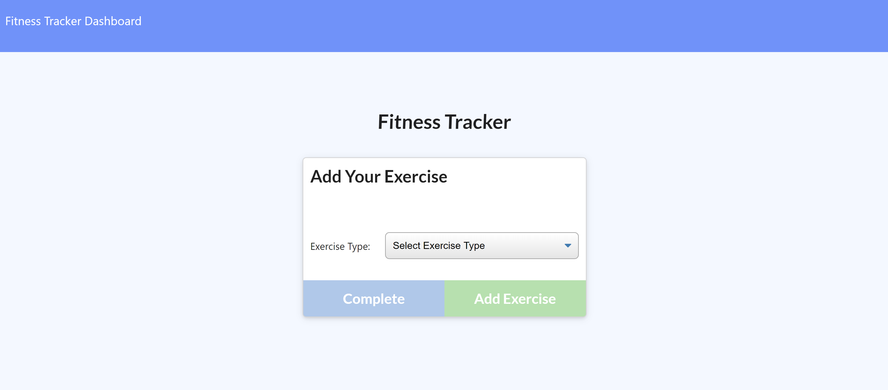
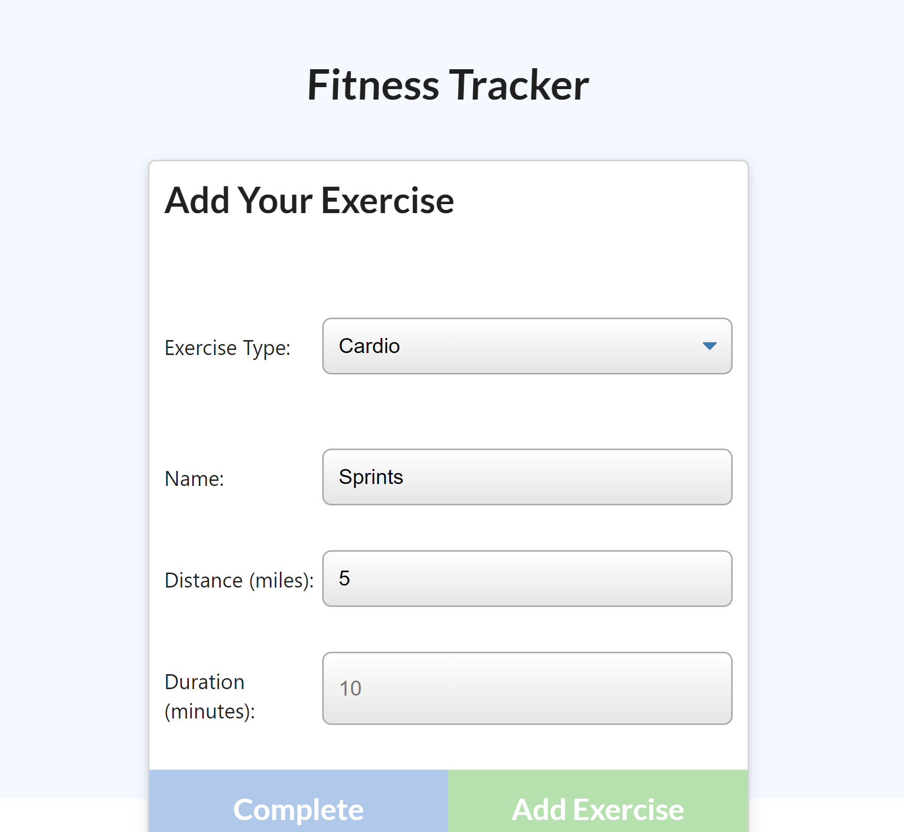
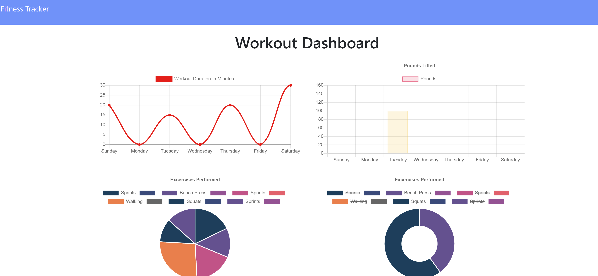
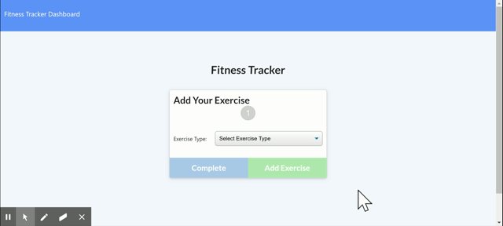

# FitnessTracker

# **FitnessTracker**

#### *Created By Charles Price, (cfprice3)*
#### email: cfprice3@gmail.com
#### git url: https://github.com/cfprice3
#### application url: https://serene-bayou-86556.herokuapp.com/

### *Project Description:*
This is an application created to help the user keep track of their workout sessions using MongoDB as the database..

 ## **Table of Contents**
 1. Installation
 2. Usage
 3. License
 4. Contributing
 5. Questions

### **1. Installations:**
A requirement for using this repo is installing the "express," "mongoose," "body-parser," and "morgan" npm packages.

Open the terminal and type "npm init" to create a package JSON file.  Next, type "npm install express", "npm install mongoose", "npm install body-parser", and "npm install morgan" to download the needed packages.

### **2. Usage:**
After installing the npm packages, in your terminal command line type "node server.js". The server will load onto PORT 3000.  You can then select a new exercise, input the stats of the workout, and the save those stats to view in the graphs.

You can also use the Heroku link to use just the application without utilizing the repository files to create your own app.

### **3. License:**
["MIT", "APACHE 2.0", "GPL 3.0", "BSD 3", "None"]

### **4. How you can contribute:**
Any styling or formatting contributions are welcome!  I'm not 100% in love with the provided UI.  I think it could be designed a little better to make it a more enjoyable user experience.  Some other things you could do differently, is add some images or other stylings to make it a more enticing application to use.

### **5. Questions:**
Please feel free to ask or add any questions!